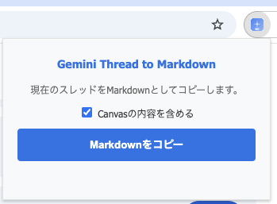
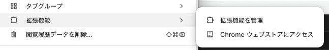
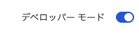

# Gemini Thread to Markdown

Geminiのチャット履歴をMarkdown形式でクリップボードにコピーするChrome拡張機能です。



## 機能

- Geminiの会話スレッドをMarkdown形式に変換
- ワンクリックでクリップボードにコピー
- コードブロック、リスト、見出しなどのフォーマットを保持

## インストール方法

### 1. リポジトリをクローン

```bash
git clone https://github.com/ktyubeshi/Gemini-Thread-to-Markdown.git
```

### 2. Chrome拡張機能として読み込む

1. Chromeのメニューから「拡張機能」→「拡張機能を管理」を選択（または `chrome://extensions/` にアクセス）

   

2. 右上の「デベロッパーモード」をオンにする

   

3. 「パッケージ化されていない拡張機能を読み込む」をクリック

   

4. クローンしたフォルダ内の `extension` フォルダを選択

## 使い方

1. [Gemini](https://gemini.google.com/)でチャットを開く
2. ブラウザのツールバーにある拡張機能アイコンをクリック
3. 「Markdownをコピー」ボタンをクリック
4. 会話がMarkdown形式でクリップボードにコピーされます

## 出力形式

```markdown
# スレッドタイトル

## User
ユーザーのメッセージ

---

## Gemini
Geminiの回答

---
```

## 対応環境

- Google Chrome（Manifest V3対応）
- Gemini (gemini.google.com)
